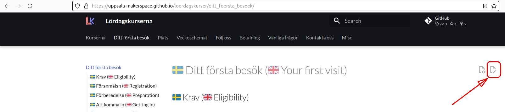

# 🇸🇪 Att hjälpa med 🇬🇧 Contributing

=== "🇸🇪"

    Tack för att du funderar på att bidra och läsa detta!

    Du kan bidra genom att:

    - Rätta stavfel, förtydliga meningar
    - Göra mig medveten om eventuella missuppfattningar
    - Lägga till förslag på saker att lägga till

    Du kan göra det genom att:

    - För frågor kan du [skapa ett ärende](https://github.com/uppsala-makerspace/3d_skrivningskurs/issues)

    Oavsett vad dessa är skapas de när du klickar på ikonen
    'Edit page' ('Redigera sida') som finns längst upp till höger på varje sida.

    ???- fråga "Var är ikonen 'Edit page'?"

        Ikonen 'Edit page' finns längst upp till höger på varje sida.

        

    Det kommer att finnas en tendens att acceptera dina bidrag
    när det hjälper till att uppnå denna webbplats mål,
    som är att hjälpa människor att förstå hur att attvända 3D skrivarna
    hos Uppsala Makerspace.

    Den här sida följer [Contributor Covenant Code of Conduct](CODE_OF_CONDUCT.md).

=== "🇬🇧"

    Thank you for considering contributing and reading this!

    You can contribute by:

    - Correcting typos, clarifying sentences
    - Making me aware of possible misconceptions
    - Add suggestions for items to add

    You can do this by:

    - You can [create an issue](https://github.com/uppsala-makerspace/3d_skrivningskurs/issues)

    Whatever these are, they are created when you click on the icon
    'Edit page' ('Edit page') which is located at the top right of every page.

    ???- ask "Where is the 'Edit page' icon?"

    The 'Edit page' icon is located at the top right of every page.

    

    There will be a tendency to accept your contributions
    when it helps achieve the goal of this site,
    which is to help people understand how to use the 3D printers
    at Uppsala Makerspace.

    This site follows the [Contributor Covenant Code of Conduct](CODE_OF_CONDUCT.md).
