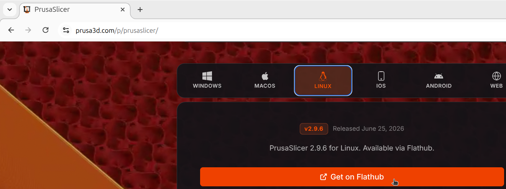
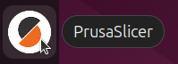
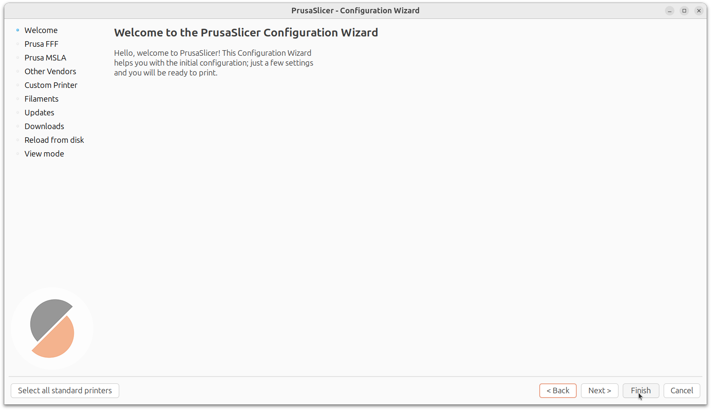
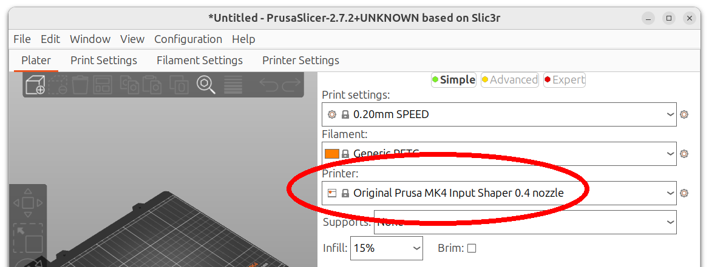
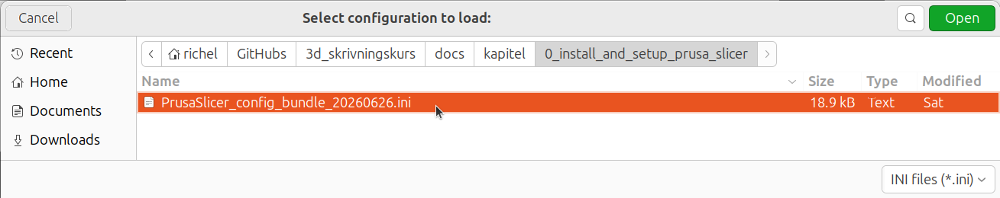
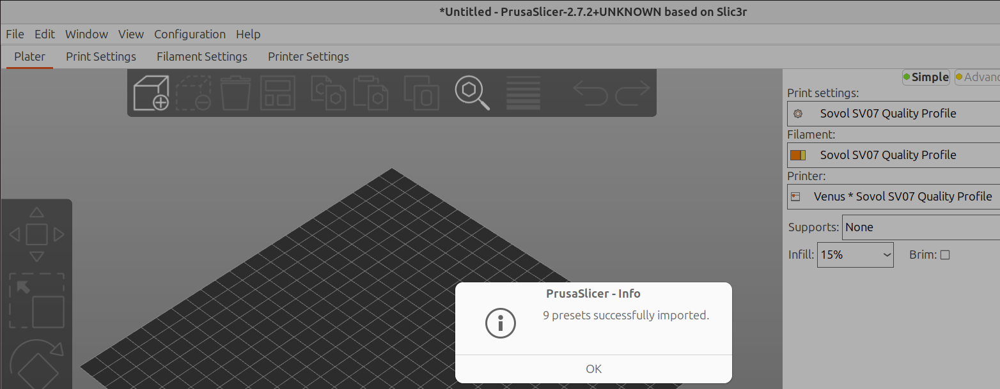
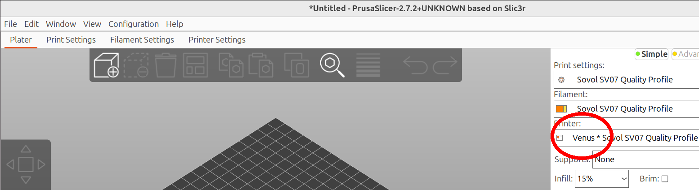

# 🇸🇪 0. Att installera och konfigurera PrusaSlicer 🇬🇧 Installing and configuring PrusaSlicer

## 🇸🇪 0.1. Att installera PrusaSlicer 🇬🇧 0.1. Installing PrusaSlicer

=== "🇸🇪"

    Om du kann inte starta PrusaSlicer (ser nästa steg),
    måste man installera detta program.

    I en webbläsare, söka 'Download PrusaSlicer'
    eller går direct till
    [`https://www.prusa3d.com/p/prusaslicer`](https://www.prusa3d.com/p/prusaslicer).

    Där kann du ladda ner filerna för ditt favorit operativsystem.

=== "🇬🇧"

    If you cannot start PrusaSlicer (see next step),
    you must install this program.

    In a browser, search for 'Download PrusaSlicer'
    or go directly to
    [`https://www.prusa3d.com/p/prusaslicer`](https://www.prusa3d.com/p/prusaslicer).

    There you can download the files for your favorite operating system.

=== "🇸🇪"

    Starta filen för att installera PrusaSlicer.

=== "🇬🇧"

    Launch the file to install PrusaSlicer.

\pagebreak

## 🇸🇪 0.2. Att starta PrusaSlicer 🇬🇧 0.2. Starting PrusaSlicer

=== "🇸🇪"

    ...

=== "🇬🇧"

    ...

På din dator, startar PrusaSlicer. På datorerna i Uppsala Makerspace
finns det ofta en ikon på Skrivbordet. Klicka på PrusaSlicer ikonen.

=== "🇸🇪"

    ...

=== "🇬🇧"

    ...

Nu startar PrusaSlicer. Om den visar den så-kallade 'Configuration Wizard'
('Konfigurations hjälpare'), klicka på 'Finish' ('Klar').

\pagebreak

## 🇸🇪 0.3. Att konfigurera PrusaSlicer 🇬🇧 0.3. Configuring PrusaSlicer

=== "🇸🇪"

    Om PrusaSlicer inte visar våra 3D skrivaren
    (dem har namn av planeter),
    är det dags att konfigurera PrusaSlicer.

    Här ser det ut när PrusaSlicer inte visar en av våra 3D skriverna:

=== "🇬🇧"

    If PrusaSlicer doesn't show our 3D printers
    (they have names of planets),
    it's time to configure PrusaSlicer.

    Here's what it looks like when PrusaSlicer doesn't show one of our 3D printers:

=== "🇸🇪"

    Uppsala Makerspace har en konfigurationsfil för alla sina
    3D skrivarna.

    I en webbläsare, söka 'Uppsala Makerspace wiki 3D printing'
    eller går direct till
    [`https://wiki.uppsalamakerspace.se/3D-printing`](https://wiki.uppsalamakerspace.se/3D-printing).

=== "🇬🇧"

    Uppsala Makerspace has a configuration file for all of their
    3D printers.

    In a browser, search for 'Uppsala Makerspace wiki 3D printing'
    or go directly to
    [`https://wiki.uppsalamakerspace.se/3D-printing`](https://wiki.uppsalamakerspace.se/3D-printing).

\pagebreak

\pagebreak

=== "🇸🇪"

    Ladda ner den senaste konfigurationsfilen.

=== "🇬🇧"

    Download the latest configuration file.

\pagebreak

=== "🇸🇪"

    I PrusaSlicer, klicka 'File | Import | Import Config Bundle'.

=== "🇬🇧"

    In PrusaSlicer, click 'File | Import | Import Config Bundle'.

\pagebreak

=== "🇸🇪"

    Leta efter konfigurationsfilen och klicka på 'Open' ('Öppna').

=== "🇬🇧"

    Search for the configuration file and klick on 'Open' ('Öppna').

\pagebreak

=== "🇸🇪"

    Clicka på 'OK' om en fönster visar att allt har lyckats.

=== "🇬🇧"

    Click 'OK' if a window shows that everything was successful.

\pagebreak

=== "🇸🇪"

    Nu visar PrusaSlicer att vår 3D skrivaren kallade 'Venus' är tillgängligt.

=== "🇬🇧"

    Now PrusaSlicer shows that our 3D printer called 'Venus' is available.

=== "🇸🇪"

    Grattis! Nu kann du skriva ut i 3D!

=== "🇬🇧"

    Congratulations! You can now 3D print!

