# Installing and configuring PrusaSlicer for our 3D printers

[](https://uppsala-makerspace.github.io/3d_skrivningskurs/kurserna)


To print, you need an STL file of your drawing.
In both Blender and OpenSCAD, you can export your drawing to STL.

In Blender, click 'File | Export | Stl (.stl)'
to export your model to an STL file.

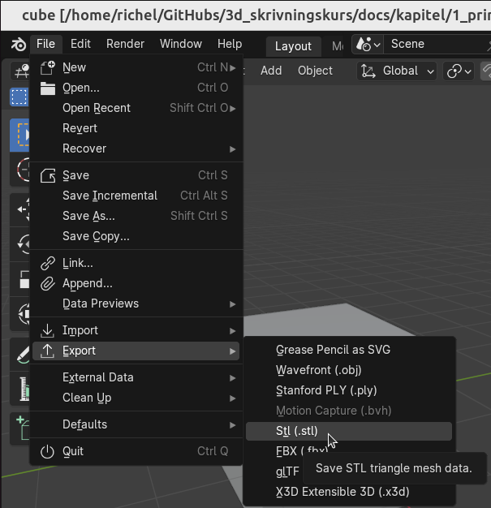


In OpenSCAD, click 'File | Export | Export as STL'
to export your model to an STL file.

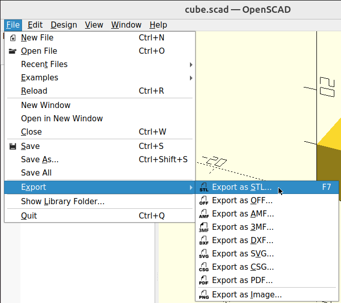


## 1.1. To load an STL file into PrusaSlicer


Start the program called PrusaSlicer.

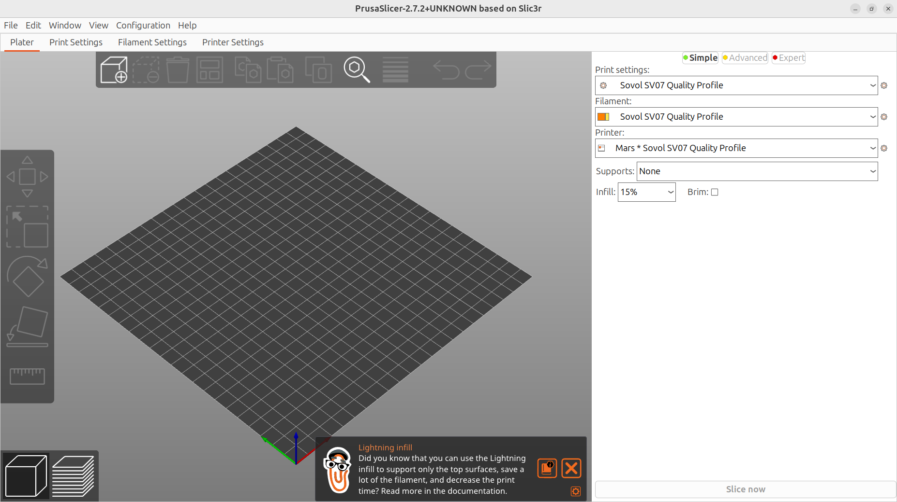


Click on 'File | Import | Import STL'.

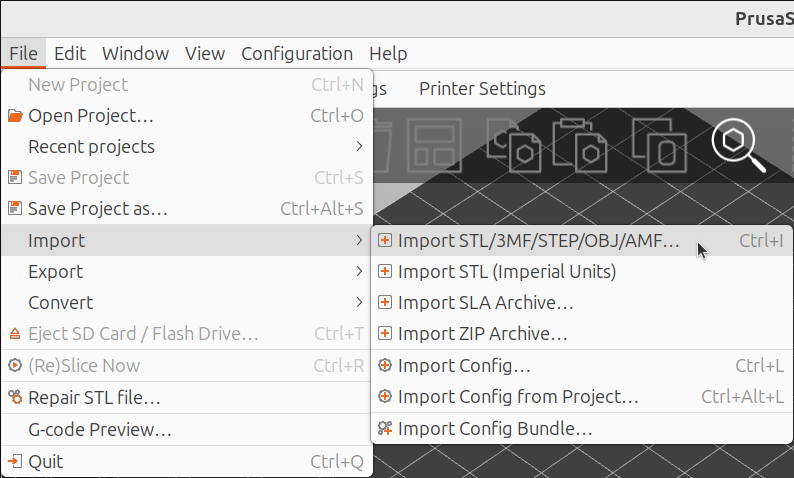


Select an STL file and click on 'Open'.

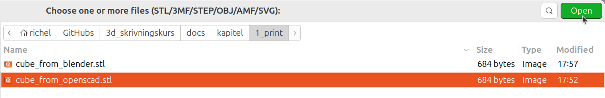


Now you have loaded a cube into PrusaSlicer. It looks something like this:

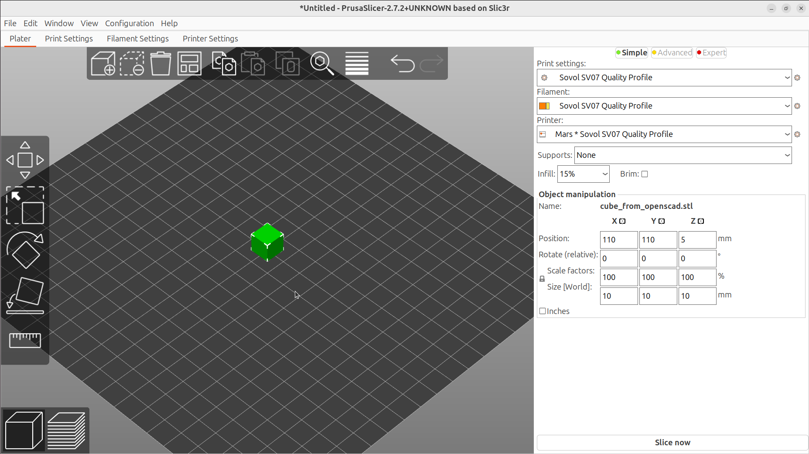


## 1.2. Picking a 3D printer


In the Makerspace, look for a 3D printer that is available.
Each 3D printer has a name. For example,
this printer down here is called 'Merkurius'.


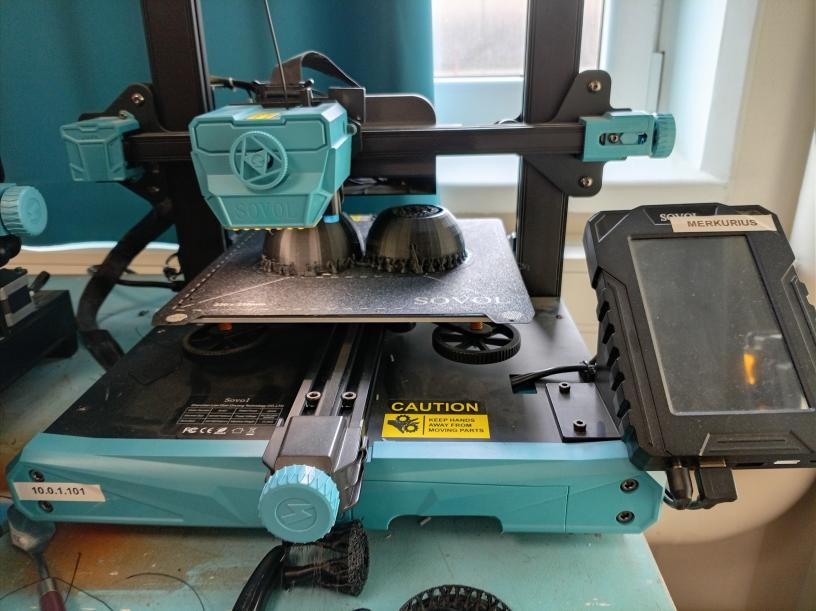


In PrusaSlicer, select the same 3D printer.

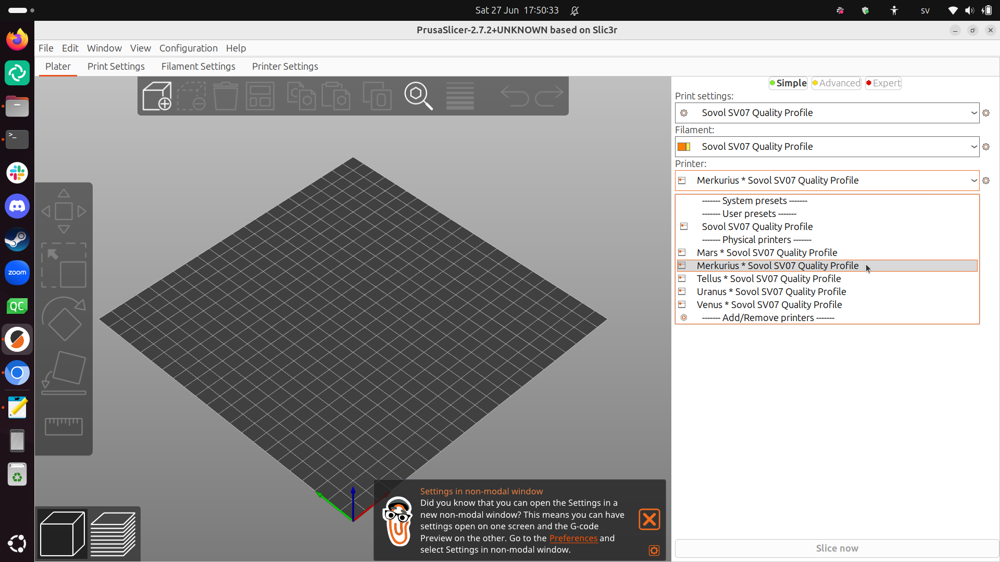


## 1.4. Slicing


Klicka på 'Slice now'.

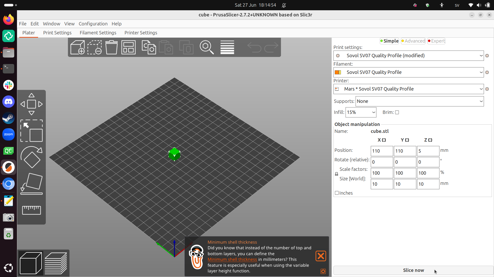


Now the slicing is done.


## 1.4. Printing


At Uppsala Makerspace we have two rules about 3D printing:

- During your first print, you must look at the printer the whole time.
The goal is that you see what a normal/successful print looks like
- During your later prints, you must be within earshot of the printer.
The goal is that you can stop the printer when something goes wrong.

Your first print will take a little less than 10 minutes.

If you understand the rules, click 'Send to print' ('Send to printer')
in the bottom-right corner:

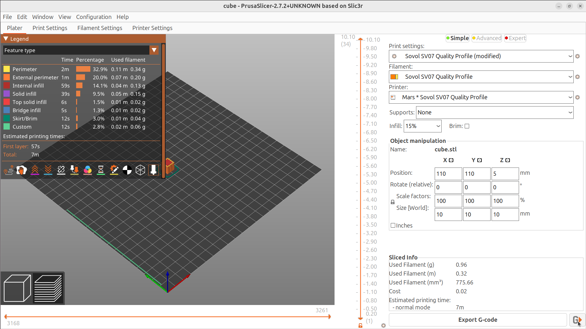


You will be asked what the printer must be called for your 3D print.

Click 'Upload and print' ('load up and print').

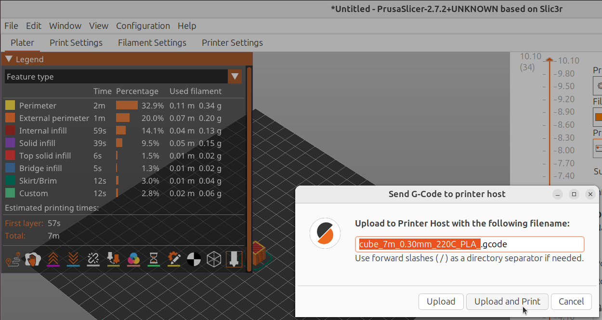


The 3D printer should now start working.

Again, the rule is that, during your first print,
you have to look at the printer all the time.
The goal is that you see what a normal/successful print looks like.

So, what do you see the printer doing first?

Look at the screen of the 3D printer.
How long should your 3D print take?

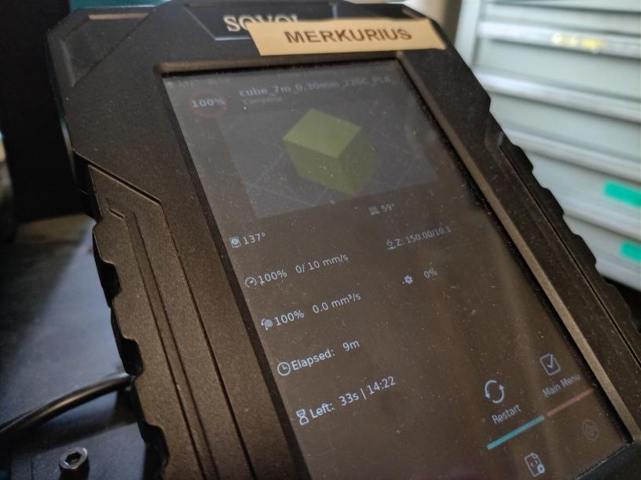


On the heating bed (the plate where the printing takes place),
on the front there is a symbol of a fingerprint.
What do you think it means?

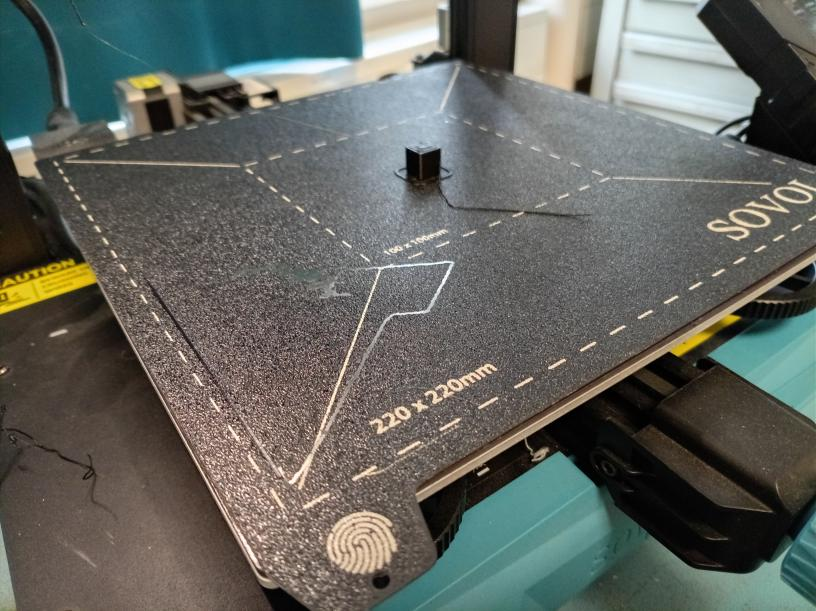


## 1.6. After printing


When the print is done, we do **not** remove it directly.
Instead, we wait until  the heating bed has cooled down to
lower than 30 degrees Celsius.

We will use the websites of our 3D to determine this (and more).

Connect to the UMS WiFi. Then, in your webbrowser, type
in the search bar the URL matching your printer.


Printer  |URL
---------|------------
Merkurius|`10.0.1.101`
Venus    |`10.0.1.102`
Tellus   |`10.0.1.103`
Mars     |`10.0.1.104`
Uranus   |`10.0.1.105`

```
PICTURE OF TYPING 10.0329842 IN BROWSER
```


You will now see the website of your favorite 3D printer.

```
SCREENSHOT OF WEBSITE
```


At the website of your favorite 3D printer,
you can see how long the print took.

```
SCREENSHOT OF WEBSITE WITH ANNOTATED TIME
```


We are interested in finding out when the heat bed has cooled down
to less than 30 degrees celsius.

It is shown here:

```
SCREENSHOT OF WEBSITE WITH ANNOTATED HEAT BED TEMPERATURE
```


When the heat bed is less than 30 degrees Celsius,
you can remove your 3D print with **tools** (i.e. **not** your hands).
Use a metal tool to poke at the bottom of your 3D print
(this will not damage the heating bed).

When the 3D print is loose, use **a tool** to push it off the 3D printer
(i.e. do **not** use your hands).

```
PICTURE OF scraping the cube.
```


If everything was successful: congratulations, you have printed your first thing!

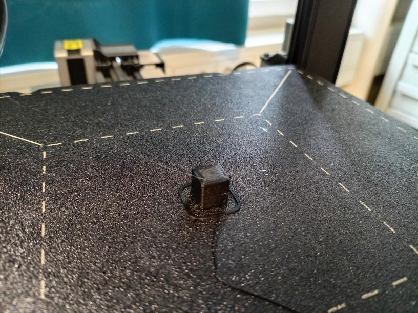
