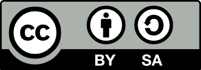

# 🇸🇪 Förord 🇬🇧 Foreword

=== "🇸🇪"

    Detta är en bok om 3D skrivning hos Uppsala Makerspace.
    Denna bok lär dig att göra det.


=== "🇬🇧"

    This is a book about 3D printing at Uppsala Makerspace.
    This book teaches you how to do it.

## 🇸🇪 Om den här boken 🇬🇧 About this book

=== "🇸🇪"

    Denna bok är licensierad av CC-BY-SA.

=== "🇬🇧"

    This book is licensed under CC-BY-SA.



```text
(C) Richèl Bilderbeek och alla lärare och alla elever
```

=== "🇸🇪"

    Med det här häftet kan du göra vad du vill, så länge du hänvisar till
    originalversionen på denna webbplats:
    [`https://uppsala-makerspace.github.io/3d_skrivningskurs/`](https://uppsala-makerspace.github.io/3d_skrivningskurs/).
    Detta häfte kommer alltid att förbli gratis, fritt och öppet.

    Det är fortfarande en lite slarvig bok.
    Det finns stafvel och la*youten ä*r in`te all`t**id vack**er.
    Eftersom den här boken finns på en webbplats
    kan alla som tycker att den här boken är för slarvig göra den mindre slarvig.

=== "🇬🇧"

    You can do whatever you want with this booklet, as long as you reference
    the original version on this website:
    [`https://uppsala-makerspace.github.io/3d_skrivningskurs/`](https://uppsala-makerspace.github.io/3d_skrivningskurs/).
    This booklet will always remain free, open and free.

    It is still a bit of a sloppy book.
    There is are zpelling errrors and the la*yout i*s no`t always be`a**utif**ul.
    Since this book is on a website
    anyone who thinks this book is too sloppy can make it less sloppy.
