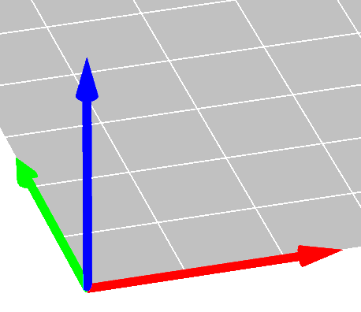

---
tags:
  - 3D
  - print
  - printing
  - skrivning
  - kurs
  - course
---

# 🇸🇪 3D skrivingskurs 🇬🇧 3D printing course

=== "🇸🇪"

    Den här kurs är en kurs
    bland den [Lördagskurserna](https://uppsala-makerspace.github.io/loerdagskurser/)
    hos [Uppsala Makerspace](https://www.uppsalamakerspace.se/),
    var man lär sig att skriva ut 3D modeller.

=== "🇬🇧"

    This is one of the courses of
    [the Saturday Courses](https://uppsala-makerspace.github.io/loerdagskurser/)
    at [Uppsala Makerspace](https://www.uppsalamakerspace.se/),
    where one can learn how to print 3D models.

# 🇸🇪 Likadana dokument 🇬🇧 Similar documents

=== "🇸🇪"

    Det finns mer dokument som visar hur att 3D skriva ut saker hos
    Uppsala Makerspace.
    Dem är listade på [3D printing Wiki sida](https://wiki.uppsalamakerspace.se/3D-printing).

=== "🇬🇧"

    There are more documents showing how to 3D print things at
    Uppsala Makerspace.
    They are listed on the [3D-printing Wiki page](https://wiki.uppsalamakerspace.se/3D-printing).
