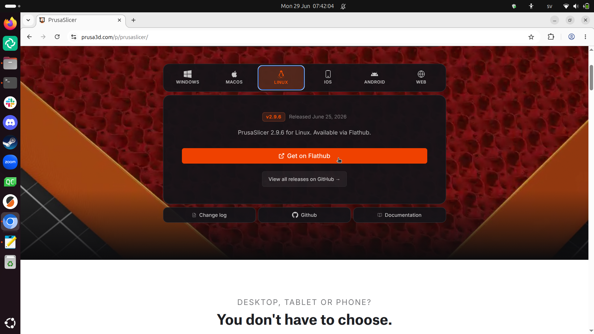
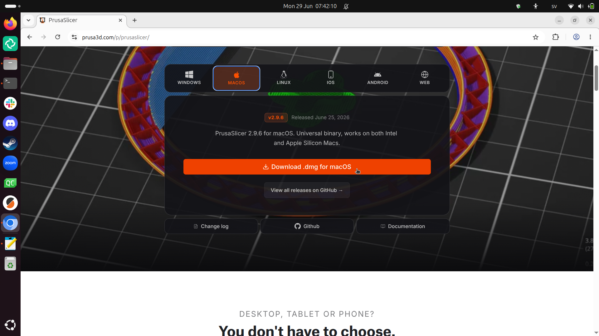
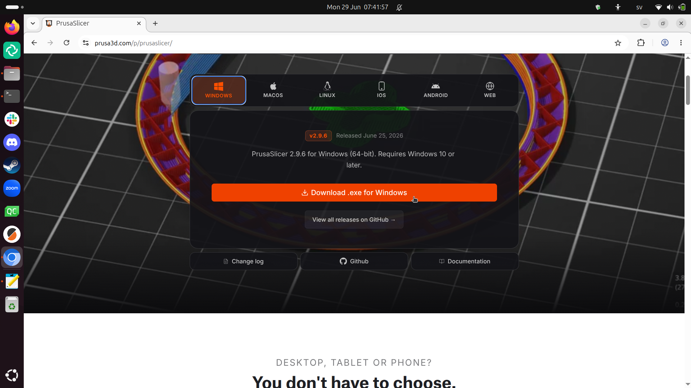
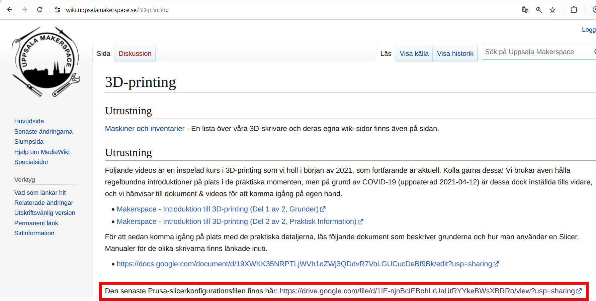
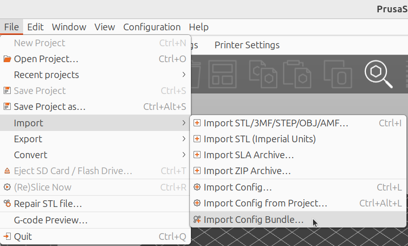

# 0. Att installera och konfigurera PrusaSlicer

## 0.1. Att installera PrusaSlicer

I en webbläsare, söka 'Download PrusaSlicer'
eller går direct till
[`https://www.prusa3d.com/p/prusaslicer`](https://www.prusa3d.com/p/prusaslicer).

Där kann du ladda ner filerna för ditt favorit operativsystem.

Starta filen för att installera PrusaSlicer.

## 0.2. Att ladda ner Uppsala Makerspace konfigurationsfil

Uppsala Makerspace har en konfigurationsfil för alla sina
3D skrivarna.

I en webbläsare, söka 'Uppsala Makerspace wiki 3D printing'
eller går direct till
[`https://wiki.uppsalamakerspace.se/3D-printing`](https://wiki.uppsalamakerspace.se/3D-printing).

Ladda ner den senaste konfigurationsfilen.

## 0.3. Att konfigurera PrusaSlicer

I PrusaSlicer, klicka 'File | Import | Import Config Bundle'.

Öppna konfigurationsfilen.
